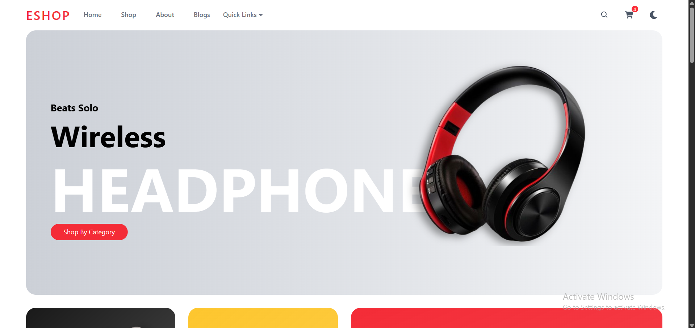
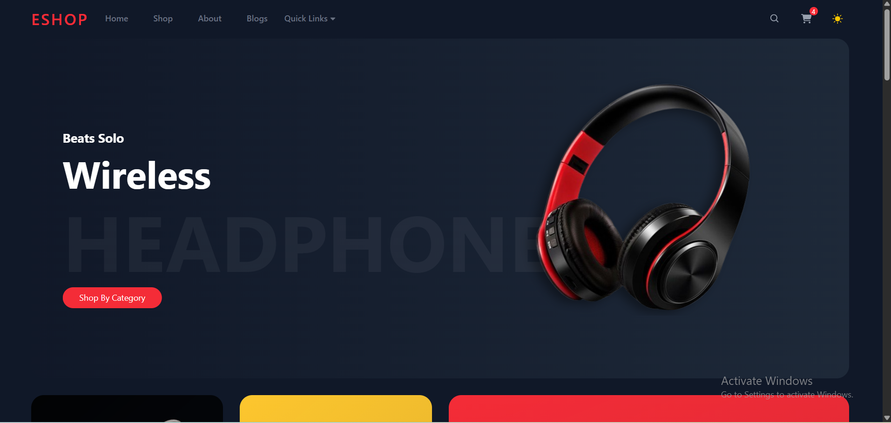
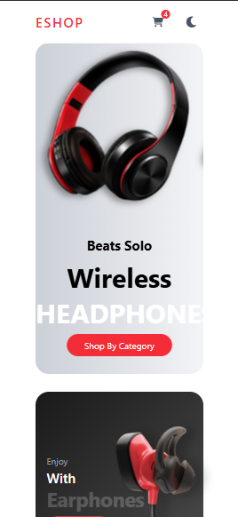

-- Eshop-App --

A modern, responsive e-commerce landing page built with React, Tailwind CSS, and enhanced with AOS (Animate on Scroll) animations.
Deployed on Vercel - designed as a part of my developer portfolio to showcase clean UI, interactivity, and component-based architecture.

-- Features --

=> Responsive, mobile-first design
=> Dark/Light mode toggle
=> Hero slider with promotional banners
=> Product categories with engaging layouts
=> Services section with icons & text
=> Promotional banners with call-to-actions
=> Product showcase & blogs
=> Partners/brands section
=> Scroll-to-top button
=> Order popup modal
=> Reusable components and clean code
=> Animations with AOS (Animate on Scroll) 

-- Screenshots Desktop --

Light Mode: 
  

Dark Mode:
  

-- Screenshots Mobile --

Light Mode:

-- Tech Stack --

=> React - UI library
=> Tailwind CSS - styling and layout
=> AOS (Animate on Scroll) - animations
=> react-icons - icons
=> Vercel - deployment platform

-- Project Structure --

src/
assets/         # Images and icons
components/     # Main sections: Navbar, Hero, Category, Brand, Banner, Products
layout/         # Theme and layout utils
shared/         # Reusable components (Button, Heading)
App.jsx         # Root component
main.jsx        # Entry point

-- Credits --

=> Images and icons: Unsplash, Flaction, react-icons
=> AOS animations: AOS Library

-- License --

=> MIT License

-- Getting Started --

1. Clone the repository:
    git clone https://github.com/yourusername/eshop-app.git
    cd eshop-app
2. Install dependencies:
    npm install
3. Start the development server:
    npm run dev
4. Open your browser and navigate to http://localhost:5173

-- Links --

=> GitHub repository: https://github.com/yourusername/eshop-app
=> Live Demo: https://yourusername.eshop-app.vercel.app